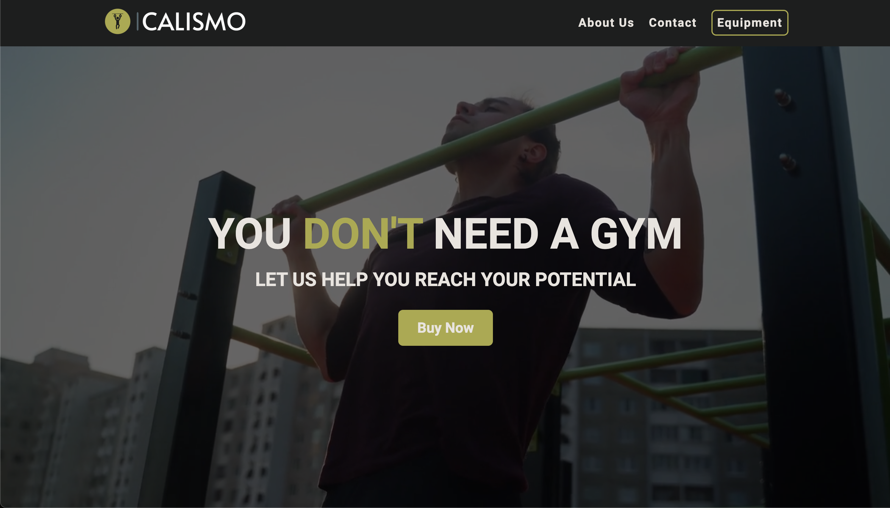
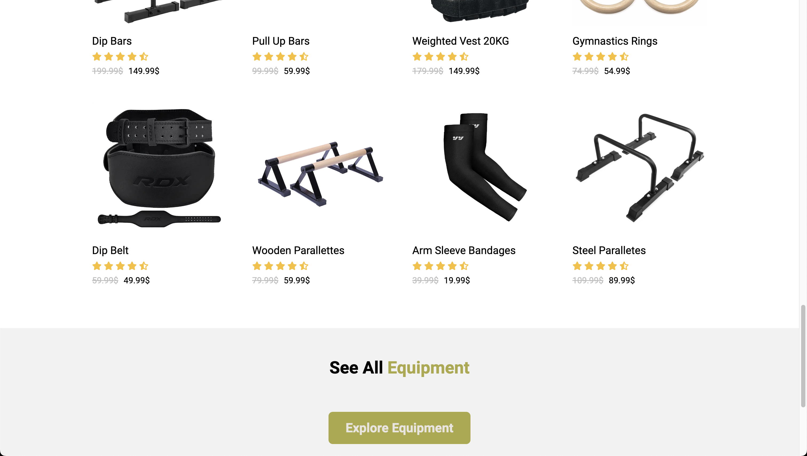

# Calismo

## Description

Calismo is an e-commerce store project to showcase my skills. The site features a range of calisthenics products and is made to be user friendly on all devices. The Site is still not complete, future updates will add more features.

## Table of Contents

- [Demo](#demo)
- [Screenshots](#screenshots)
- [Features](#features)
- [Technologies Used](#technologies-used)

## Demo

[Click Here To See The Hosted Site](https://mhmdlsiblini.github.io/Calismo-Project/)

## Screenshots:

  

## Features

- Responsive Design with Media Queries
- Smooth Transitions and Simple Animations
- User Friendly Design
- Future Updates Will Add Awesome Feature That Will Elevate This Project

## Technologies Used

- HTML
- CSS
- JavaScript
